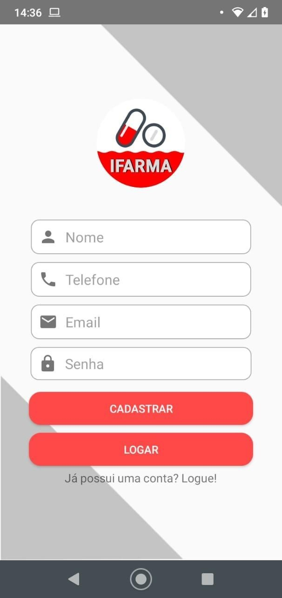
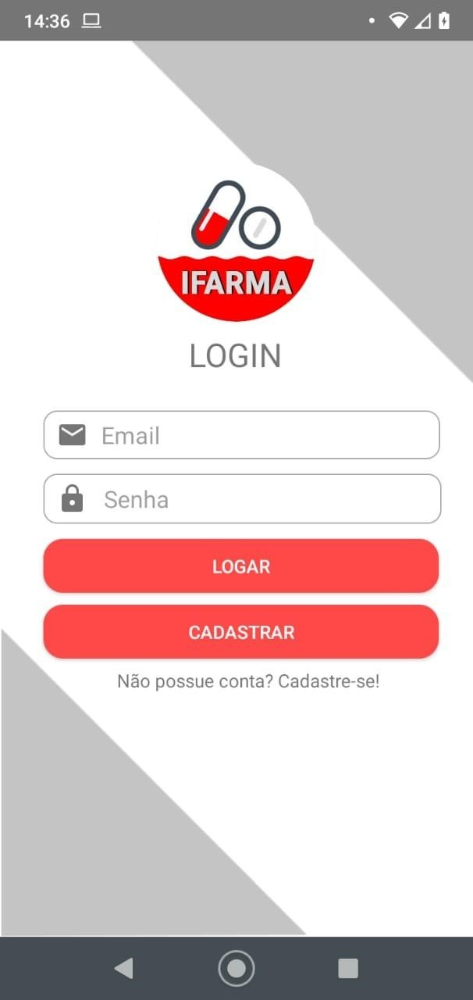
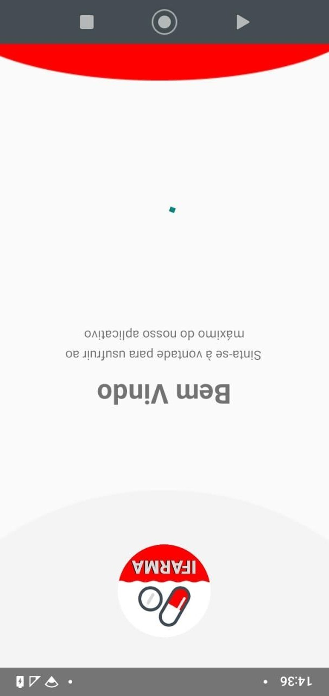
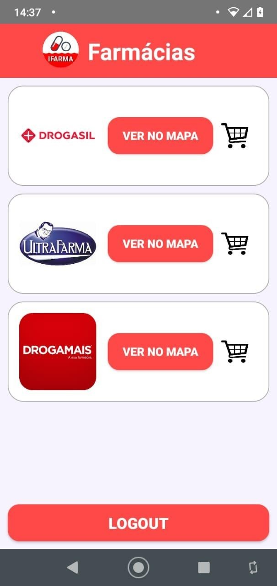
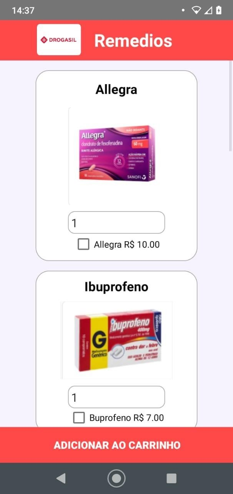
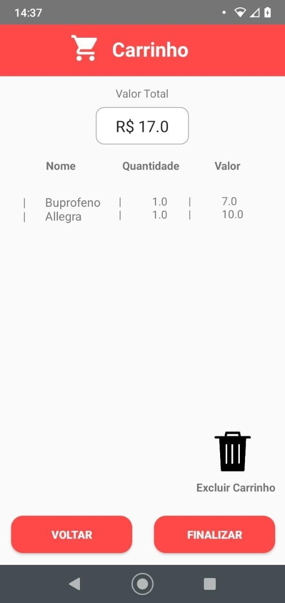

# iFarma
<h3> O iFarma é um app criado para um trabalho acadêmico onde o usuário pode tanto comprar de diversas farmácias quanto verificar a distância da farmácia. </h3>
Tela de cadastro  
  
Tela de login  
   
Tela splash  
   
Farmácias  
   
Direção até a farmácia.  
   
Loja da farmácia  
   
Carrinho  
   
